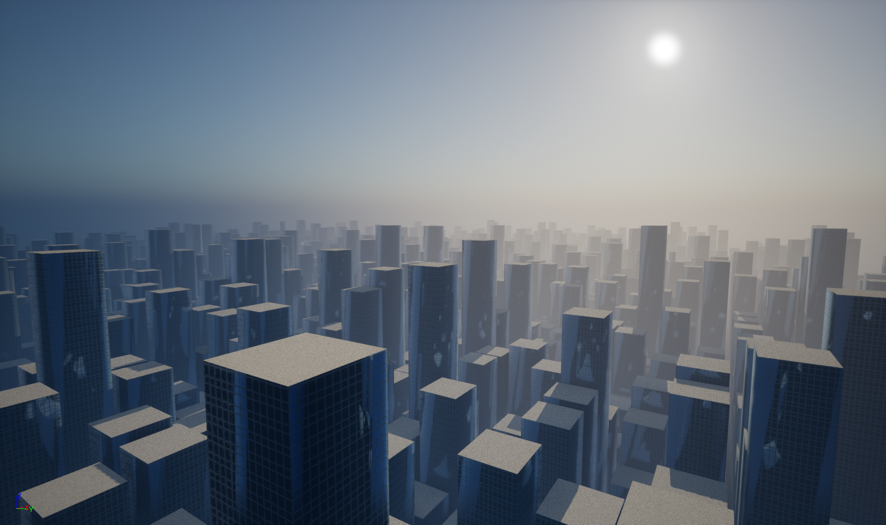
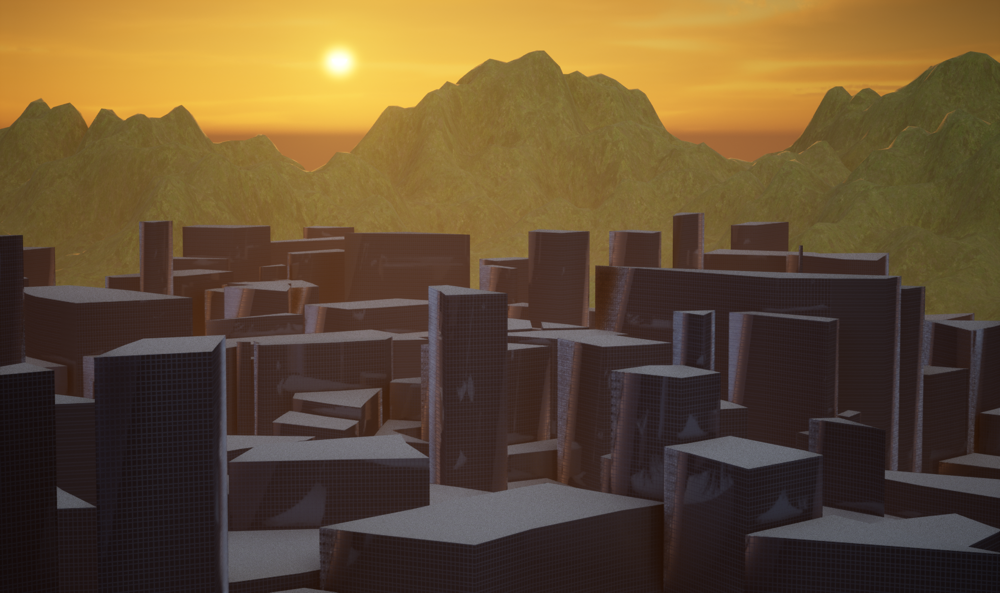

# Procedural City Generation
This project contains the implementations of several procedural generation methods used to generate a virtual city. All algorithms are written in C++ for use in Unreal Engine.

The city generation is split into 3 parts: terrain generation, road network generation and buildings generation. For each part there are 2 diffent methods.

Terrain generation:
* Perlin noise
* Diamond-square

Road network generation:
* Voronoi based roads
* Custom road expansion algorithm

Building generation:
* Plot extrusion
* Shrinking layer stacking

# Examples of generated cities:

Terrain: diamond-square  
Road network: voronoi  
Buildings: layer stacking  
 

Terrain: flat  
Road network: voronoi (grid)  
Buildings: extrusion  
 

Terrain: flat  
Road network: voronoi  
Buildings: layer stacking  
 

Terrain: perlin  
Road network: custom  
Buildings: extrusion  
